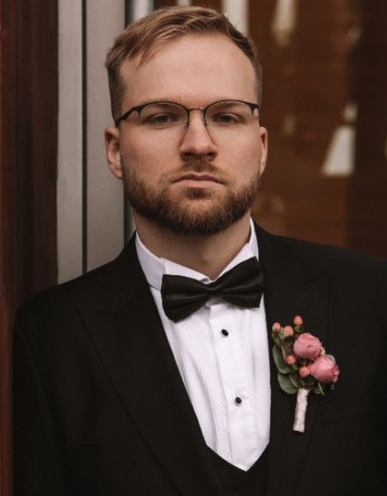

# **Artem Pashentsev**



## Contact information:

- E-mail: artem2695post@yandex.ru

- [Whats-app](https://wa.me/+79999645808)

- [Discord:stimorol95#8973](https://discord.com/channels/@me/626266222471675906)

- [Telegram](https://t.me/stimorol95)

- [Github](https://github.com/stimorol95)

## About Me

My name is Artem, I am 26 years old. I work as an engineer at a research institute where I design space satellites. My goal is to be a frontend developer. I have a great motivation in development and constantly want to learn new things.

The ability to work in multitasking mode and high analytical skills allow me to work effectively with large amounts of information, quickly find high-quality solutions to complex problems.

## Skills

*Web-development: HTML5, CSS3, JavaScript
*Source code editor: Visual Studio Code
*Version control: GitHub, Git
*Frameworks: React
*Graphic editor: Figma

## Code Example

Task from codewars website:

Complete the solution so that it reverses the string passed into it.
`'world' => 'dlrow' 'word' => 'drow' `

```
function solution(str) {

  let splitString = str.split('');

  let reverseArray = splitString.reverse();

  let joinArray = reverseArray.join('');

  return joinArray;

}

console.log(solution('world'));
```

## Education

In 2017, I graduated from the Aviation Institute: Faculty of Control Systems, Informatics and Power Engineering, with a degree in Navigation Systems and Inertial Sensors of Aircraft Control Systems. I am taking courses on Geekbrains, YouTube, FreeCodeCamp and RS School. On courses at Geekbrains, I made a training website with a clothing store:

[Store Link](https://stimorol95.github.io/clothing_store/)

## Language

- Russian (native)
- English (pre-intermediate)
